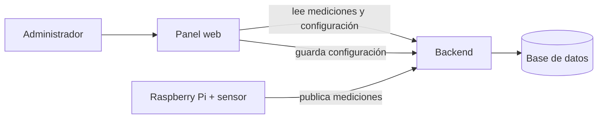

# Sistema de Control PLC — Panel web

Interfaz web para **monitorear y configurar** un sistema de control de temperatura y humedad
(proyecto de Teoría de Control, UNCAUS 2026).

Una Raspberry Pi con un sensor mide el ambiente y acciona un cooler según los umbrales
configurados; este panel le da al administrador una vista clara de qué está pasando y le
permite ajustar esos umbrales.

## Qué resuelve

- **Ver el clima en tiempo real**: temperatura, humedad, estado del cooler y estado general,
  con tendencia y comparación contra los umbrales configurados.
- **Configurar el control**: definir los rangos de temperatura/humedad, la histéresis del
  cooler y cada cuánto mide la Raspberry, con una vista previa de cómo va a comportarse.
- **Auditar y analizar**: historial de cambios de configuración y de mediciones, con
  promedios, tiempo fuera de rango y uso del cooler.
- **Operar con confianza**: avisa cuando el sensor deja de reportar o cuando una lectura se va
  de rango.

## Pantallas

1. **Tablero** — indicadores en vivo (con tendencia y variación), análisis del rango elegido
   (promedios, % fuera de rango, uso del cooler) y un gráfico de las últimas lecturas.
2. **Configuración** — formulario de umbrales con validación y una vista previa en vivo de la
   banda de histéresis del cooler y de los cambios respecto de la configuración activa.
3. **Historial de configuraciones** — auditoría de cada cambio (quién, cuándo, qué valores).
4. **Mediciones** — historial de lecturas con filtros, gráficos y exportación.
5. **Modo kiosco** — un monitor a pantalla completa con auto-refresco, pensado para mostrar el
   sistema en vivo (por ejemplo, en la defensa del trabajo).

## Funcionalidades destacadas

- **Tiempo real** con auto-refresco e indicador de “última actualización”.
- **Alertas** de sensor desconectado, lectura fuera de rango o estado crítico (con avisos del
  navegador opcionales).
- **Gráficos interactivos**: zoom por arrastre, leyenda para mostrar/ocultar series y bandas de
  umbral.
- **Exportar**: imagen (PNG) de cada gráfico —con su título, pantalla y fecha de descarga— y
  datos a CSV; además un **reporte imprimible / PDF** del tablero en una sola página.
- **Adaptado a celular**: navegación inferior, vista de tarjetas y “tirar para refrescar”.
- **Instalable como app (PWA)**, con tema claro/oscuro y atajos de teclado (Ctrl/⌘ + K).
- **Accesible**: foco visible, soporte de lectores de pantalla y respeto por “reducir
  movimiento”.

## Cómo se conecta



> El **backend** (API REST + lógica del sistema físico: sensor, OpenPLC, relay, cooler y el
> control con histéresis) vive en su propio repositorio:
> [plc-control-backend](https://github.com/andinogabriel/plc-control-backend).

## Cómo correr

Necesitás el **backend corriendo** (ver su README). Luego:

```bash
cp .env.example .env   # ajustar VITE_API_BASE_URL si el backend no está en http://localhost:8080
npm install
npm run dev            # http://localhost:5173
```

Para producción: `npm run build` genera el sitio estático en `dist/`, publicable en Vercel,
Netlify o cualquier hosting estático (configurando `VITE_API_BASE_URL`).

Para inspeccionar el peso del bundle, `npm run build:analyze` genera y abre un treemap por chunk
en `dist/stats.html` (no afecta al build normal).

## Variables de entorno

| Variable | Default | Para qué sirve |
| --- | --- | --- |
| `VITE_API_BASE_URL` | `http://localhost:8080` | URL base de la API del backend. |
| `VITE_CONFIG_API_KEY` | *(vacío)* | Opcional. Solo si el backend tiene `APP_CONFIG_API_KEY` seteado: el panel la manda como header `X-Api-Key` en `POST /api/config`. |

> Una key embebida en una SPA pública es una barrera mínima anti-abuso, **no** un secreto real.
> Toda la seguridad de verdad vive en el backend (ver más abajo).

## Nota de seguridad

Toda la validación y el control de abuso viven en el **backend**. El panel no es la frontera de
seguridad: es solo la cara visible del sistema.

---

# Arquitectura (para contribuir)

> El resto del README es para *usar* el panel. Esta parte es para *trabajar* en él: por qué está
> organizado así y qué regla seguir al agregar cosas.

## Estilo arquitectónico

Es una **SPA por capas**, con una regla central: **cada cosa en su capa y una sola dirección de
dependencias** (`pages → components / hooks → lib / api → theme`). Ninguna capa "salta" a otra:
un componente no hace `fetch`, una página no define estilos sueltos, una utilidad no conoce React.

```
src/
├── api/         Única capa que habla con el backend: un axios client + funciones tipadas.
│                Nada más en la app hace fetch. Los tipos de respuesta viven en api/types.ts.
├── pages/       Un componente por ruta ("smart"): orquesta queries y compone componentes.
├── components/  UI reutilizable, mayormente presentacional (recibe datos por props).
│                Las pocas "smart" (AlertCenter, CommandPalette, MeasurementStream) son chrome global.
├── hooks/       Lógica con estado reutilizable (useSystemHealth, useCountUp, useReducedMotion…).
├── lib/         Helpers puros, sin React ni MUI (format, time, exporters). Fáciles de testear.
├── theme.ts     Design system centralizado (tema MUI claro/oscuro). El único lugar de "estilo base".
└── App.tsx / main.tsx   Rutas (lazy por pantalla) y providers (Query, Theme, Toast, Alerts, Router).
```

Decisiones que conviene respetar:

- **Estado del servidor → TanStack Query.** No se hace fetch manual ni se guarda data del backend
  en `useState`. Cada vista declara sus `useQuery`/`useMutation` con su `queryKey`; el polling vive
  en `refetchInterval` y se usa `placeholderData: keepPreviousData` para que no parpadee al cambiar
  de rango.
- **Estado de UI → `useState`/hooks**; **estado "compartible" (filtros, rango) → la URL**
  (`useSearchParams`), así un link reproduce la vista (ver `HistoryPage`/`ConfigHistoryPage`).
- **Formularios → React Hook Form + Zod.** La validación del front es un *espejo* de la del backend
  (mismos límites), nunca la única (ver `ConfigurationPage`).
- **Estilos → `theme` + prop `sx`. No hay archivos `.css`.** Los colores salen del `palette` (para
  que claro/oscuro funcionen solos). En MUI v9 las system props van dentro de `sx`.
- **El backend es la frontera de seguridad**, no el front: acá no se valida de verdad ni se loguea
  información sensible.

## Diseño responsive (por qué desktop ≠ mobile)

Es **una sola base de código** con breakpoints de MUI (`useMediaQuery`), no dos apps. Pero la misma
data se **reorganiza** según el dispositivo, en vez de encoger el desktop:

| | Desktop | Mobile |
| --- | --- | --- |
| Navegación | sidebar persistente (`Drawer`) | barra inferior alcanzable con el pulgar (`MobileBottomNav`) |
| Tablas | `DataGrid` denso con filtros por columna | lista de tarjetas (`MobileCardList`) |
| Filtros | en los headers de columna | hoja inferior (`MobileFilterSheet`) |
| Gestos | hover / click | *pull-to-refresh*, tap |
| Layout | grilla multi-columna | una columna apilada |

El motivo: un backoffice con mucha data necesita **densidad** en pantalla grande y **ergonomía
táctil + reflow** en el teléfono; una tabla densa no entra en un celular. El **modo kiosco** es una
ruta aparte a pantalla completa (sin chrome), por diseño, para mostrar el sistema en vivo.

Accesibilidad como requisito, no extra: foco visible, `aria-label`s, navegación por teclado
(Ctrl/⌘ + K) y respeto por `prefers-reduced-motion` (hook `useReducedMotion` + media queries en las
animaciones).

## Cómo agregar algo nuevo

- **Llamada al backend** → función en `api/<x>Api.ts` + tipo en `api/types.ts` (no hagas `fetch`
  en un componente).
- **Pantalla** → `pages/XPage.tsx`, ruta `lazy` en `App.tsx`, e ítem en `Layout` **y**
  `MobileBottomNav`.
- **UI reutilizable** → `components/`, presentacional, *theme-aware* (`sx`) y accesible.
- **Lógica reutilizable** → `hooks/`; **helper puro** → `lib/` con su test.
- **Datos** vía TanStack Query; **formularios** vía RHF + Zod; **animaciones** con guard de
  reduced-motion.
- ⚠️ **Regla de Fast Refresh** (la hace cumplir ESLint): *un archivo que exporta un componente debe
  exportar solo componentes*. Constantes/helpers/hooks van en un módulo aparte (un `.ts` hermano o
  `lib/`) — si no, salta `react-refresh/only-export-components`.

## Calidad

Antes de abrir un PR, todo en verde:

```bash
npx tsc --noEmit     # tipos
npm run lint         # ESLint (flat config) — 0 errores
npm run test         # Vitest + Testing Library + MSW (unitario e integración)
npm run test:e2e     # Playwright (smoke)
npm run build        # build de producción
```

Tests: lo puro se prueba en `lib/`; los componentes/pantallas con Testing Library + **MSW**
(mock del backend, ver `pages/DashboardPage.test.tsx`); el `smoke` e2e con Playwright.

---

Stack: React · TypeScript · Vite · Material UI · TanStack Query · React Hook Form + Zod.
