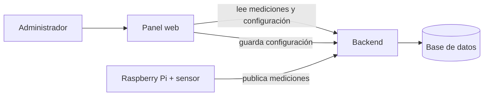

# Sistema de Control PLC — Panel web

Interfaz web para **monitorear y configurar** un sistema de control de temperatura y humedad
(proyecto de Teoría de Control, UNCAUS 2026).

Una Raspberry Pi con un sensor mide el ambiente y acciona un cooler según los umbrales
configurados; este panel le da al administrador una vista clara de qué está pasando y le
permite ajustar esos umbrales.

## Qué resuelve

- **Ver el clima en tiempo real**: temperatura, humedad, estado del cooler y estado general,
  con tendencia y comparación contra los umbrales configurados.
- **Configurar el control**: definir los rangos de temperatura/humedad, la histéresis del
  cooler y cada cuánto mide la Raspberry, con una vista previa de cómo va a comportarse.
- **Auditar y analizar**: historial de cambios de configuración y de mediciones, con
  promedios, tiempo fuera de rango y uso del cooler.
- **Operar con confianza**: avisa cuando el sensor deja de reportar o cuando una lectura se va
  de rango.

## Pantallas

1. **Tablero** — indicadores en vivo (con tendencia y variación), análisis del rango elegido
   (promedios, % fuera de rango, uso del cooler) y un gráfico de las últimas lecturas.
2. **Configuración** — formulario de umbrales con validación y una vista previa en vivo de la
   banda de histéresis del cooler y de los cambios respecto de la configuración activa.
3. **Historial de configuraciones** — auditoría de cada cambio (quién, cuándo, qué valores).
4. **Mediciones** — historial de lecturas con filtros, gráficos y exportación.
5. **Modo kiosco** — un monitor a pantalla completa con auto-refresco, pensado para mostrar el
   sistema en vivo (por ejemplo, en la defensa del trabajo).

## Funcionalidades destacadas

- **Tiempo real** con auto-refresco e indicador de “última actualización”.
- **Alertas** de sensor desconectado, lectura fuera de rango o estado crítico (con avisos del
  navegador opcionales).
- **Gráficos interactivos**: zoom por arrastre, leyenda para mostrar/ocultar series y bandas de
  umbral.
- **Exportar**: imagen (PNG) de cada gráfico —con su título, pantalla y fecha de descarga— y
  datos a CSV; además un **reporte imprimible / PDF** del tablero en una sola página.
- **Adaptado a celular**: navegación inferior, vista de tarjetas y “tirar para refrescar”.
- **Instalable como app (PWA)**, con tema claro/oscuro y atajos de teclado (Ctrl/⌘ + K).
- **Accesible**: foco visible, soporte de lectores de pantalla y respeto por “reducir
  movimiento”.

## Cómo se conecta



> El **backend** (API REST + lógica del sistema físico: sensor, OpenPLC, relay, cooler y el
> control con histéresis) vive en su propio repositorio:
> [plc-control-backend](https://github.com/andinogabriel/plc-control-backend).

## Cómo correr

Necesitás el **backend corriendo** (ver su README). Luego:

```bash
cp .env.example .env   # ajustar VITE_API_BASE_URL si el backend no está en http://localhost:8080
npm install
npm run dev            # http://localhost:5173
```

Para producción: `npm run build` genera el sitio estático en `dist/`, publicable en Vercel,
Netlify o cualquier hosting estático (configurando `VITE_API_BASE_URL`).

Para inspeccionar el peso del bundle, `npm run build:analyze` genera y abre un treemap por chunk
en `dist/stats.html` (no afecta al build normal).

## Variables de entorno

| Variable | Default | Para qué sirve |
| --- | --- | --- |
| `VITE_API_BASE_URL` | `http://localhost:8080` | URL base de la API del backend. |
| `VITE_CONFIG_API_KEY` | *(vacío)* | Opcional. Solo si el backend tiene `APP_CONFIG_API_KEY` seteado: el panel la manda como header `X-Api-Key` en `POST /api/config`. |

> Una key embebida en una SPA pública es una barrera mínima anti-abuso, **no** un secreto real.
> Toda la seguridad de verdad vive en el backend (ver más abajo).

## Nota de seguridad

Toda la validación y el control de abuso viven en el **backend**. El panel no es la frontera de
seguridad: es solo la cara visible del sistema.

---

Stack: React · TypeScript · Vite · Material UI. Detalles técnicos y de contribución, en el
código y en los PRs del repositorio.
