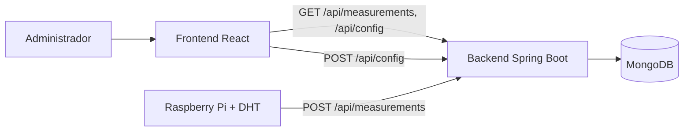

# Frontend — Sistema de Control PLC

Interfaz web para el sistema de control de temperatura/humedad (proyecto de Teoría de
Control, UNCAUS 2026).
React 19 · Vite · TypeScript · Material UI · MUI X (DataGrid, Charts, Date Pickers) ·
TanStack Query · React Hook Form + Zod · dayjs.

Layout responsive con **sidebar** colapsable (permanente en desktop, drawer con menú
hamburguesa en mobile), selector de **tema claro/oscuro/sistema**, y footer institucional.
Rutas y textos en español; el DataGrid usa la localización `esES` de MUI.

## Qué es y cómo encaja

El admin usa esta web para **configurar los umbrales** del sistema y **monitorear** el clima
en tiempo real. La Raspberry publica las mediciones en el backend; esta app las lee y muestra.



> El diagrama completo del sistema (sensor, OpenPLC, relay, cooler y la lógica de control con
> histéresis) está en el README del backend.

## Pantallas

1. **Dashboard** (`/tablero`): cards clickeables (llevan a Mediciones) con temperatura,
   humedad, estado del cooler y estado general, más un gráfico de las últimas lecturas con
   **selector de rango** (última hora, 12 h, día, semana, mes, año). Ocupa todo el ancho
   disponible. Auto-refresca cada 5 s.
2. **Configuración** (`/configuracion`): formulario con nombre/email + umbrales, validación
   con Zod (espejo del backend), POST a `/api/config`, errores de validación y manejo de 429.
3. **Historial de config** (`/historial-configuracion`): auditoría del admin. DataTable
   paginada server-side (fecha, nombre, email, umbrales, histéresis, activa), filtros por
   fecha/nombre/email (contains sin acentos) y gráficos de evolución de umbrales.
4. **Mediciones** (`/mediciones`): tabla paginada con filtros de fecha y estado, última
   medición y gráficos de temperatura y humedad vs tiempo.

### Rendimiento

- **Lazy loading por ruta** (`React.lazy` + `Suspense`): cada página es un chunk que se
  descarga al navegar. La ruta inicial pesa pocos kB.
- **Vendors separados** (`manualChunks` en `vite.config.ts`): MUI core, DataGrid, Charts,
  Date Pickers, React y React Query van en chunks cacheables independientes.

### Tablas (DataGrid)

- Altura fija equivalente a 10 filas; si se elige una página mayor, la tabla scrollea por
  dentro manteniendo esa altura.
- El selector de filas por página **deshabilita** las opciones que superan el total (con 11
  filas solo 10 y 20 quedan habilitadas).
- Paginador y selector en una sola fila (también en mobile), con botones de primera/última página.
- **Ordenamiento server-side** por columna: el título es clickeable (asc → desc → sin orden)
  y la flecha indica el sentido; el orden viaja al backend y se mantiene entre páginas.
- Headers y valores centrados; en mobile la tabla scrollea horizontalmente mostrando todas las columnas.
- La paginación es server-side y el estado (page/size/orden/filtros) se refleja en los **query
  params de la URL**, así los enlaces son compartibles y recargables.

### Filtros

- **Por columna (tabla)**: cada columna filtrable tiene un ícono que abre un popover con el
  input apropiado (rango de fechas, numérico con validación, select, on/off) y un botón
  "Aplicar". Es server-side; cada filtro se acumula en la URL.
- **Barra superior (gráficos)**: el rango de fechas (y estado en Mediciones) de arriba ajusta
  únicamente los gráficos, de forma independiente al filtrado de la tabla.

### Gráficos (`@mui/x-charts`)

- Área con degradado, curvas suaves y ejes limpios; etiquetas y tooltips en español.
- **Leyenda clickeable**: tocar una serie (p. ej. Temperatura / Humedad o T. mín / T. máx)
  muestra u oculta esa línea.
- **Click en un punto** abre un diálogo con el detalle: en Historial config muestra quién
  configuró y todos los umbrales; en Mediciones, la lectura completa. Los diálogos son
  **arrastrables** por el encabezado y se cierran con la X (sin salirse de la pantalla).

## Estructura

```
public/
└── uncaus-logo.svg       # logo institucional (favicon + footer) — ver public/LEEME-logo.txt
src/
├── main.tsx              # bootstrap: QueryClient + tema + LocalizationProvider + Router
├── App.tsx               # rutas (lazy) en español
├── colorMode.tsx         # proveedor de tema claro/oscuro/sistema (persistido)
├── theme.ts              # factory del tema MUI (createAppTheme)
├── api/
│   ├── client.ts         # instancia axios (baseURL desde VITE_API_BASE_URL)
│   ├── types.ts          # tipos espejo de los DTOs del backend
│   ├── configApi.ts      # endpoints de configuración
│   └── measurementApi.ts # endpoints de mediciones
├── components/
│   ├── Layout.tsx              # sidebar responsive + AppBar + selector de tema + footer
│   ├── AppDataGrid.tsx         # DataGrid con altura de 10 filas + paginador + estado vacío
│   ├── DataTablePagination.tsx # paginador en una fila, opciones deshabilitadas por total
│   ├── columnFilters.tsx       # filtros + orden por columna en popover (texto, número, rango, fecha, select)
│   ├── AreaLineChart.tsx       # gráfico con degradado, leyenda clickeable y click → detalle
│   ├── DetailDialog.tsx        # diálogo de detalle arrastrable (click en un punto)
│   ├── TableEmptyOverlay.tsx   # mensaje centrado cuando la tabla no tiene datos
│   ├── chartStyle.ts           # estilo y formateo (español) de los gráficos
│   └── StatusChip.tsx          # chip de estado (etiquetas en español)
└── pages/
    ├── DashboardPage.tsx
    ├── ConfigurationPage.tsx
    ├── ConfigHistoryPage.tsx   # auditoría de configuraciones (tabla + filtros + gráfico)
    └── HistoryPage.tsx         # historial de mediciones
```

> **Logo institucional**: el logo de la UNCAUS está en `public/uncaus-logo.svg`
> (se usa como favicon y en el footer). Si falta, no rompe nada (ver `public/LEEME-logo.txt`).

## Cómo levantar localmente

Necesitás el **backend corriendo** (ver su README). La forma más rápida es levantar el
backend + MongoDB con Docker y el frontend con npm:

```bash
# 1) Backend + Mongo + datos de prueba (en la carpeta del backend)
docker compose up --build

# 2) Frontend (en esta carpeta)
cp .env.example .env      # ajustar VITE_API_BASE_URL si hace falta (por defecto http://localhost:8080)
npm install
npm run dev
```

App en `http://localhost:5173`. Si el backend corre en otra URL, ajustá `VITE_API_BASE_URL`
en el `.env`.

## Build de producción

```bash
npm run build     # genera dist/
npm run preview   # sirve el build localmente
```

## Deploy gratuito

- **Vercel** o **Netlify**: importar el repo, framework Vite detectado automáticamente.
  Configurar la variable de entorno `VITE_API_BASE_URL` apuntando al backend público.
- El output es estático (`dist/`), no requiere servidor Node.

## Notas de seguridad

El `deviceFingerprint` se genera en el cliente (user-agent + idioma + resolución) solo
como señal **best-effort** para el cooldown del backend. Toda la validación real y el
rate limiting viven en el backend: el frontend no es la frontera de seguridad.
